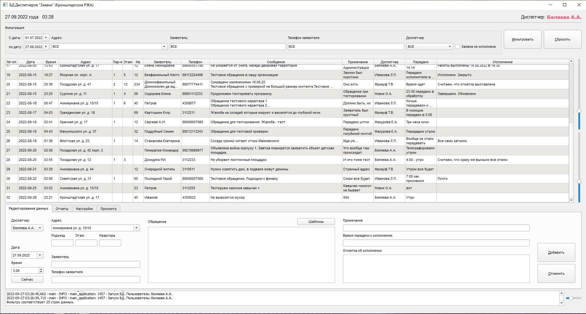
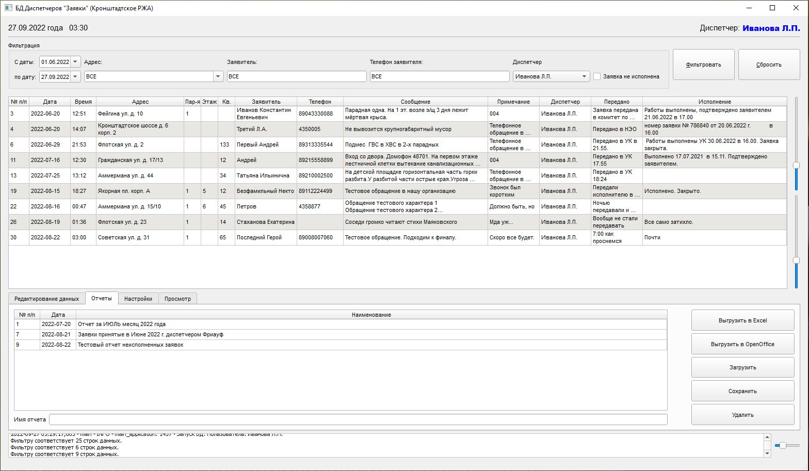
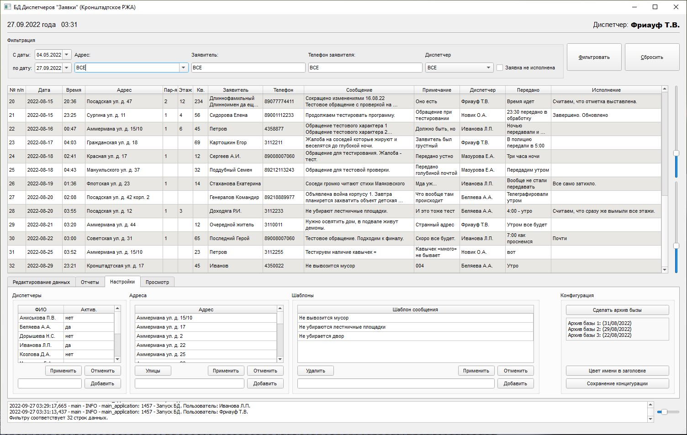

# База Данных диспетчеров (заявки)

## Описание программы:
Программа предназначена для ведения базы данных принятых заявок.
Диспетчеры (работники организации) принимают по телефону жалобы граждан и 
вносят информацию в программу, посредством заполнения рабочих полей.
> *программа использует SQLite3*

### Основные возможности программы:
> Внесение первичной заявки
> 
> Редактирование внесенной ранее заявки
> 
> Фильтрация данных по условию
> 
> Сохранение отфильтрованных отчетов
> 
> Выгрузка отчетов в файл форматов .xlsx / .odt
> 
> Настройка таблиц

### Интерфейс программы:
>
> > *основное поле ввода новых данных -*

>
> > *работа с отчетами -*

> 
> > *настройки программы -*


### Файлы программы:
```
Archive_db          - папка с архивами БД
DataBase            - папка с основной (рабочей) базой данных
Reports             - папка для выгрузки отчетов по умолчанию
ui                  - папка с разработанными интерфейсами в формате .ui
ui_jpg              - папка с картинками программы
log.txt             - файл логирования действий пользователя
main.py             - основная программа (`ее и запускать`)
start_ui_dialog.py  - интерфейс стартового окна
ui_dispatcher.py    - интерфейс основной программы
```
